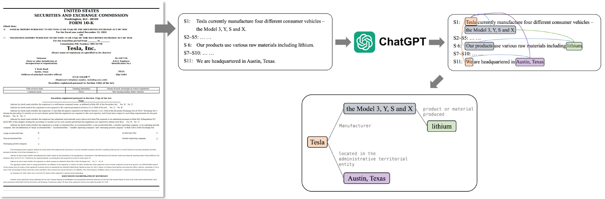

# Network-Text Analysis for 10K Report

This repo contains an Python implementation for the network-text analysis for 10K report.

--------------------

We propose an automated pipeline that generates a complementary supply chain graph using ChatGPT and existing RE models.
We create and analyze supply chains for S&P 500 companies using 10K report.



## Setup

You can install required libraries using `requirements.txt`.
```.bash
pip install -r requirements.txt
```

Additionally, we provide assets that we used by this [link](https://www.dropbox.com/scl/fo/grodsrkkr4hv2b6c04grg/h?rlkey=y6uzqwi3q5m29vn63wkahgcex&dl=0).


## Run Analysis

You can open `network_text_analysis_10k_report.ipynb` and run the code blocks.

## Acknowledgements

This work was supported by the National Research Foundation of Korea (NRF) grant funded by the Korea government (MSIT) (No.2021R1A2C200981613). * MSIT: Ministry of Science and ICT